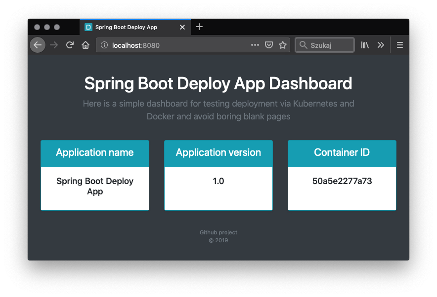

Spring Boot Deploy App
========================
During learning Kubernetes or Docker Swarm, I always faced a problem which image should I use for deployment. 
Most often I used NGINX or just a simple Spring Boot up generated from a scratch. Each time the same, blank boring 
landing page. Here is my simple tiny application dashboard based on Spring Boot and Bootstrap allows you to test 
deployment in a few various versions, with a few customized parameters.

Docker Image
------------

Info
----
* Name: `slydeveloper/spring-boot-deploy-app`
* Version: `latest`,`3.0`,`2.1`,`1.1`
* [Docker Hub](https://hub.docker.com/r/slydeveloper/spring-boot-deploy-app/)

Details
--------
* Image based on `openjdk:11.0.1-jre-slim`
* Spring Boot version: `2.1.6.RELEASE`
* Default port: `8080`
* URL: `http://localhost:8080/`
* Health check URL - `http://localhost:8080/actuator/health`
* Actuator info URL - `http://localhost:8080/actuator/info`

Usage
-----
* `docker run -d -p 8080:8080 --name spring-boot-deploy-app slydeveloper/spring-boot-deploy-app`
* `docker run -d -p 8080:8080 -e SPRING_BOOT_DEPLOY_APP_TITLE="My Spring Boot Deploy App Example" -e SPRING_BOOT_DEPLOY_APP_NAME="My Spring Boot Deploy App Title" --name spring-boot-deploy-app slydeveloper/spring-boot-deploy-app`

Screenshot
-----

