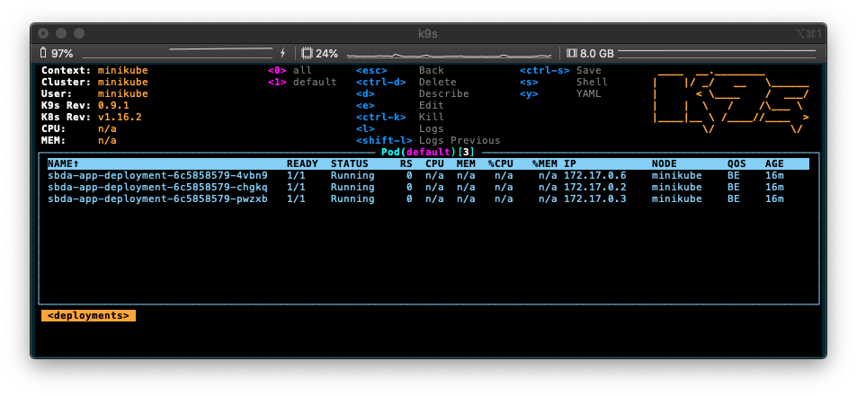
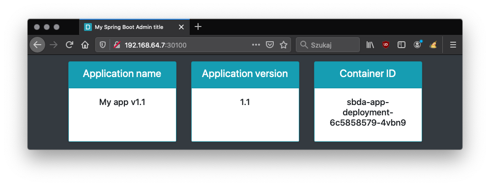
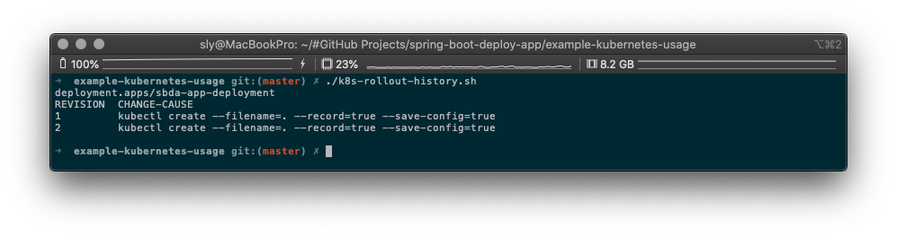
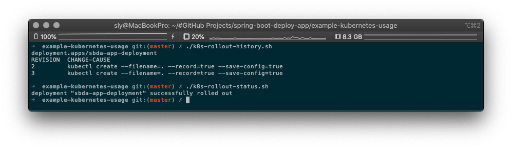

SBDA - Kubernetes example
=========================

## Requirements
* Minikube
    * tested on `v1.7.2`

## Deployment
1. Start Minikube
    * `$ ./k8s-minikube-start.sh`
2. Deploy application on K8S (`version 1.1`)
    * `$ ./k8s-deploy.sh`
3. Check deployment in web-browser
    * `$ ./k8s-open-service.sh`
    * use `Reload dashboard` button to refresh dashboard
    * `Container ID` should be changed

## Update deployment
1. Update application version in `sbda-app-deployment.yaml`
    * `image: slydeveloper/spring-boot-deploy-app:2.1`
4. Apply update application on K8S
    * `$ ./k8s-update.sh`

## Rollback deployment
1. Rollback update of application
    * `$ ./k8s-undo.sh`
2. Check rollback history
    * `$ ./k8s-rollout-history.sh`
3. Check rollback status
    * `$ ./k8s-rollout-status.sh`

## Misc commands
1. Stop Minikube
    * `$ ./k8s-minikube-stop.sh`
2. Undeploy application
    * `$ ./k8s-undeploy.sh`